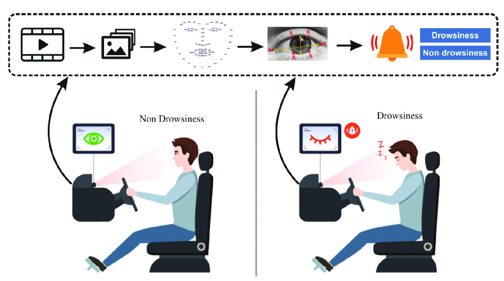

# Problem Statement

- Drowsy Driving is a deadly combination of driving and sleepiness.
- The number of road accidents due to Drowsy Driving is increasing at an alarming rate worldwide.
- Not having a proper sleep is the main reason behind drowsiness while driving. However, other reasons like sleep disorders, medication, alcohol consumption, or driving during night shifts can also cause drowsiness while driving.



# Driver-Drowsiness-Detection

- The project aims to build a system that detects drowsiness based on visual cues from the driver's face. Uses OpenCV for image
  processing, mediapipe for facial landmark detection, and matplotlib for visualization.
- The system focuses on drawing landmarks on specific facial regions like the eyes to improve detection accuracy.
- Preprocessing steps include face detection, image resizing, and data augmentation.

# Model Architecture

```python
model = Sequential([
            Conv2D(16, 3, activation='relu', input_shape=(145, 145, 3)),
            BatchNormalization(),
            MaxPooling2D(),
            Dropout(0.1),

            Conv2D(32, 5, activation='relu'),
            BatchNormalization(),
            MaxPooling2D(),
            Dropout(0.1),

            Conv2D(64, 10, activation='relu'),
            BatchNormalization(),
            MaxPooling2D(),
            Dropout(0.1),

            Conv2D(128, 12, activation='relu'),
            BatchNormalization(),

            Flatten(),

            Dense(128, activation='relu'),
            Dropout(0.25),
            Dense(64, activation='relu'),
            Dense(1, activation='sigmoid')
        ])

```
